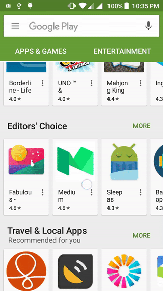

# RecyclerView snapping with SnapHelper

</img>   </img>

The 24.2.0 version of the support library introduced two new classes ([SnapHelper][1] and [LinearSnapHelper][2]) that should be used to handle snapping in a RecyclerView.

You've probably already noticed this in the Google Play app the RecyclerView snaps to the first item in the adapter.

If you use the default LinearSnapHelper, **you can only snap to the center.**

The only code needed is:

```java
SnapHelper snapHelper = new LinearSnapHelper();
snapHelper.attachToRecyclerView(recyclerView);
```

This produces an adapter that snaps its views to the center

To replicate the Google Play behavior, we need to override the **calculateDistanceToFinalSnap** and **findSnapView** methods of the LinearSnapHelper to find the start view and calculate the distance needed to snap it to the correct position.

To make this easier to do, I created a **GravitySnapHelper** that supports snapping in 4 directions (start, top, end, bottom).

If you want the same behavior as the Google Play app, now you only need to change the previous code to:

```java
SnapHelper snapHelper = new GravitySnapHelper(Gravity.START);
snapHelper.attachToRecyclerView(startRecyclerView);
```
Make sure you set the appropriate orientation in the LayoutManager too:

```java
// HORIZONTAL for Gravity START/END and VERTICAL for TOP/BOTTOM
recyclerView.setLayoutManager(new LinearLayoutManager(this,
LinearLayoutManager.HORIZONTAL, false));
```

Here's a complete example:
[RecyclerViewSnap][3]

[1]: https://developer.android.com/reference/android/support/v7/widget/SnapHelper.html
[2]: https://developer.android.com/reference/android/support/v7/widget/LinearSnapHelper.html
[3]: https://github.com/rubensousa/RecyclerViewSnap/