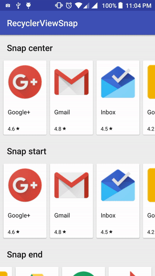

# RecyclerView snapping with SnapHelper

[](https://jitpack.io/#timrijckaert/SnappingRecyclerView)

**'Fork' of Rubensousa**

</img>   </img>

##Installation

Add it in your root build.gradle at the end of repositories:

```gradle
allprojects {
    repositories {
        ...
        maven { url "https://jitpack.io" }
    }
}
```

Add the dependency

```gradle
dependencies {
        compile 'com.github.timrijckaert:SnappingRecyclerView:v1.0'
}
```

##Usage

```java
SnapHelper snapHelper = new GravitySnapHelper(Gravity.START);
snapHelper.attachToRecyclerView(startRecyclerView);
```
Make sure you set the appropriate orientation in the LayoutManager too:

```java
// HORIZONTAL for Gravity START/END and VERTICAL for TOP/BOTTOM
recyclerView.setLayoutManager(new LinearLayoutManager(this,
LinearLayoutManager.HORIZONTAL, false));
```

Here's a complete example:
[RecyclerViewSnap][3]

[1]: https://developer.android.com/reference/android/support/v7/widget/SnapHelper.html
[2]: https://developer.android.com/reference/android/support/v7/widget/LinearSnapHelper.html
[3]: https://github.com/rubensousa/RecyclerViewSnap/